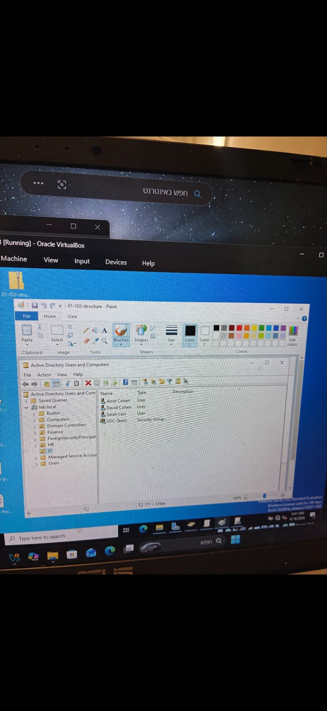
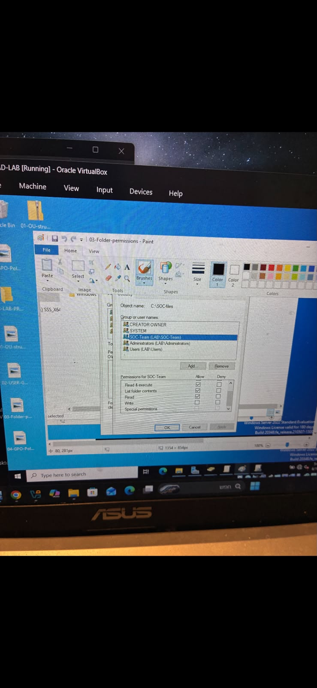

 Active Directory Home Lab

About

I built this Active Directory home lab to gain hands-on experience with Windows Server and understand how user and permission management works in a real organization.

The goal was to learn how Active Directory, Domain Controller, Groups, and Group Policies work together in an enterprise environment.

 What I Built

- Installed and configured Windows Server
- Promoted the server to a Domain Controller
- Created Organizational Units (OUs)
- Created users and security groups
- Assigned users to groups
- Configured NTFS permissions
- Created and applied Group Policy Objects (GPOs)
- Simulated a small company's Active Directory environment

What I Learned

This project helped me understand:

- How Active Directory manages identities
- Why organizations use security groups instead of assigning permissions to every user
- How Group Policies simplify administration
- How NTFS permissions control access to shared resources
- How a Domain Controller authenticates users inside a Windows domain

 Skills

- Windows Server
- Active Directory
- Domain Controller
- Organizational Units (OU)
- Group Policy (GPO)
- NTFS Permissions
- User & Group Management

Future Improvements

In the future, I plan to expand this lab by adding more users, additional Group Policies, and security monitoring tools.

## Screenshots

NTFS Permissions

 Group Policy

